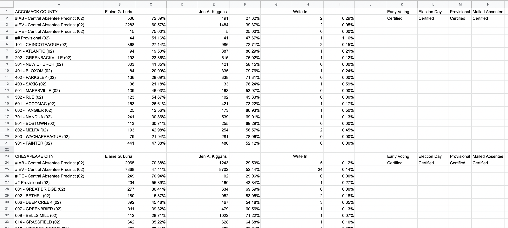

# Election Night Results Google Apps Script for VA
Google Apps Script to track election results data provided by the Virginia Department of Elections. 

This script loops through election results JSON data (provided by the VDE) for each locality and outputs into a Google Sheet. 

The script will only run one time, unless set to be executed on a timed basis (I set mine to run every one minute on Election Night). This can be found under Triggers within the Google Apps Script. 

The results will look like this (based on VA02 results data): 

