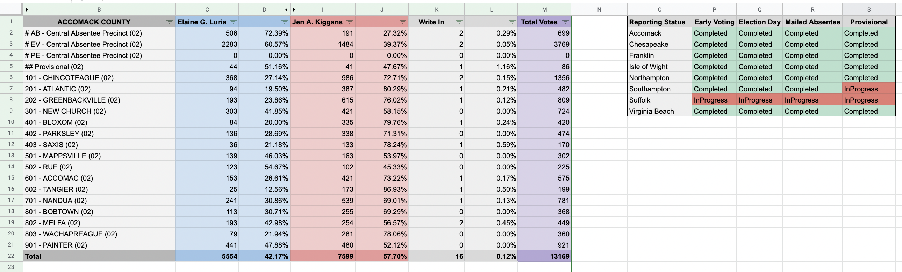

# Election Night Google Apps Script
Google Apps Script to track election results data provided by the Virginia Department of Elections. 

This script loops through election results JSON data (provided by the VDE) for each locality and outputs the paramters into a Google Sheet. 

The script will only run one time, but can be executed on a timed basis (I set mine to run every one minute). This can be found under Triggers within the Google App Script. 

The results will look like this: 

